[](https://git.io/typing-svg)

**`Artificial Intelligence | Blockchain | MERN Stack `**  

[](mailto:sifatsajin88@gmail.com)
[](https://www.linkedin.com/in/sifat-jahan-sajin-725814310/)


<!-- ═══════════════════════════════════════════════════════════ -->
<!--     ABOUT ME SECTION                                        -->
<!-- ═══════════════════════════════════════════════════════════ -->

## About Me

<div align="center">

</div>

```python
class SifatJahanSajin:
    def __init__(self):
        self.name        = "Sifat Jahan Sajin"
        self.role        = "Software Developer @ DataSoft"
        self.education   = "B.Sc. CSE — BRAC University (2025)"
        self.location    = "Dhaka, Bangladesh"
        self.focus       = ["LLM", "RAG", "Agentic AI",
                            "Blockchain SSI", "MERN"]
        self.currently   = "Building LLM-powered dev tools"
        self.passion     = "Train · Fine-tune · Deploy AI"

    def say_hi(self):
        print("Let's build something intelligent!")

me = SifatJahanSajin()
me.say_hi()
```


<!-- ═══════════════════════════════════════════════════════════ -->
<!--   🚀 TECH ARSENAL SECTION                                    -->
<!-- ═══════════════════════════════════════════════════════════ -->

## Tech Arsenal

<div align="center">

### Artificial Intelligence & Machine Learning


### Blockchain & Self-Sovereign Identity


### MERN Stack & Web


### DevOps & Tools


</div>

<!-- ═══════════════════════════════════════════════════════════ -->
<!-- 🏆 GITHUB TROPHIES SECTION                                 -->
<!-- ═══════════════════════════════════════════════════════════ -->

## GitHub Trophies
<div align="center">
  
</div>

<!-- ═══════════════════════════════════════════════════════════ -->
<!-- 🐍 CONTRIBUTION SNAKE SECTION                             -->
<!-- ═══════════════════════════════════════════════════════════ -->
## Contribution Snake

<picture>
  <source media="(prefers-color-scheme: dark)"
          srcset="https://raw.githubusercontent.com/Sajin-07/Sajin-07/output/snake-dark.svg"/>
  <source media="(prefers-color-scheme: light)"
          srcset="https://raw.githubusercontent.com/Sajin-07/Sajin-07/output/snake.svg"/>
  
</picture>


<!-- ═══════════════════════════════════════════════════════════ -->
<!-- 〰️ LINE GIF                                                -->
<!-- ═══════════════════════════════════════════════════════════ -->


<!-- ═══════════════════════════════════════════════════════════ -->
<!-- 🦜 PARROT GIF                                              -->
<!-- ═══════════════════════════════════════════════════════════ -->
<p align="center">


<p align="center">

    
<!-- ═══════════════════════════════════════════════════════════ -->
<!-- 〰️ LINE GIF                                                -->
<!-- ═══════════════════════════════════════════════════════════ -->


<!-- ═══════════════════════════════════════════════════════════ -->
<!-- 🔥 PROJECT TITLE TEXT GIF                                  -->
<!-- ═══════════════════════════════════════════════════════════ -->


<div align="center">
<table>
<tr>
<td width="50%" valign="top">

<!-- ═══════════════════════════════════════════════════════════ -->
<!-- PROJECT 1                                 -->
<!-- ═══════════════════════════════════════════════════════════ -->
<div align="center">


</div>

`FastAPI` `Ollama` `UMAP` `HDBSCAN` `Vector Embeddings`

<p align="justify">Platform orchestrating structured debates between local LLMs with Opinion-Space Topology Tracking - projecting arguments into 3D space to map opinion clustering and convergence. Runs fully offline via Ollama with zero API cost and complete data privacy.</p>

<br/>

[](https://github.com/Sajin-07/Multi-Model-Debate-Arena)

</td>
<td width="50%" valign="top">

<!-- ═══════════════════════════════════════════════════════════ -->
<!--  PROJECT 2                           -->
<!-- ═══════════════════════════════════════════════════════════ -->
<div align="center">


</div>

`LLM` `ChromaDB` `Python`

<p align="justify">Two-pass LLM system that reviews code against pre-defined standards, suggests targeted improvements, and auto-applies accepted changes directly to the codebase. Designed to reduce manual review overhead and enforce consistent code quality across large development teams.</p>

<br/>

[](https://github.com/Sajin-07/code-review-with-LLM)

</td>
</tr>
<tr>
<td width="50%" valign="top">
<br/>
<!-- ═══════════════════════════════════════════════════════════ -->
<!-- PROJECT 3                                  -->
<!-- ═══════════════════════════════════════════════════════════ -->
<div align="center">


</div>
<br/>

`ACA-Py` `Hyperledger Indy` `Fabric` `SSI`

<p align="justify">SSI-based passport and visa management system using verifiable credentials for privacy-preserving digital identity. Eliminates physical document dependency via blockchain-backed decentralized authentication across a distributed, trustless network.</p>

<br/>

</td>
<td width="50%" valign="top">
<!-- ═══════════════════════════════════════════════════════════ -->
<!-- PROJECT 4                              -->
<!-- ═══════════════════════════════════════════════════════════ -->
<div align="center">


</div>

`MongoDB` `Express` `React` `Node.js` `Firebase` `JWT` `SSLCommerz`

<p align="justify">Full-stack restaurant management platform with an AI chatbot, table reservations, Firebase and JWT dual-auth, and integrated SSLCommerz payment gateway for seamless online transactions across the entire ordering workflow.</p>

<br/>

[](https://fir-uni-af3fa.web.app/)

</td>
</tr>
</table>
</div>

<!-- ═══════════════════════════════════════════════════════════ -->
<!-- 🐱 CAT AND MOUSE LINE GIF                                  -->
<!-- ═══════════════════════════════════════════════════════════ -->
<p align="center">

<p align="center">


<!-- ═══════════════════════════════════════════════════════════ -->
<!-- 💬 QUOTES GIF                                              -->
<!-- ═══════════════════════════════════════════════════════════ -->

<p align="center">

<p align="center">

---


<!-- ═══════════════════════════════════════════════════════════ -->
<!-- 🎓 EDUCATION SECTION                                       -->
<!-- ═══════════════════════════════════════════════════════════ -->

<p align="center">


</p>

## Education  
**BSc in Computer Science & Engineering**  
BRAC University   

## Research
### Blockchain-backed SSI: Empowering Travelers with Secure Digital Identity
*Supervisor: Prof. Md. Sadek Ferdous, BRAC University*

> Designed a Self-Sovereign Identity (SSI) system for digitalized travel credentials, enabling travelers to control all verifiable documents on a single privacy-preserving decentralized platform, minimizing data exposure and physical document dependency.
---

<!-- ═══════════════════════════════════════════════════════════ -->
<!--  Fun corner                                      -->
<!-- ═══════════════════════════════════════════════════════════ -->
<div align="center">
&nbsp;


<br/><br/>


<p align="center">
  
</p>

---

<p align="center">

<p align="center">
